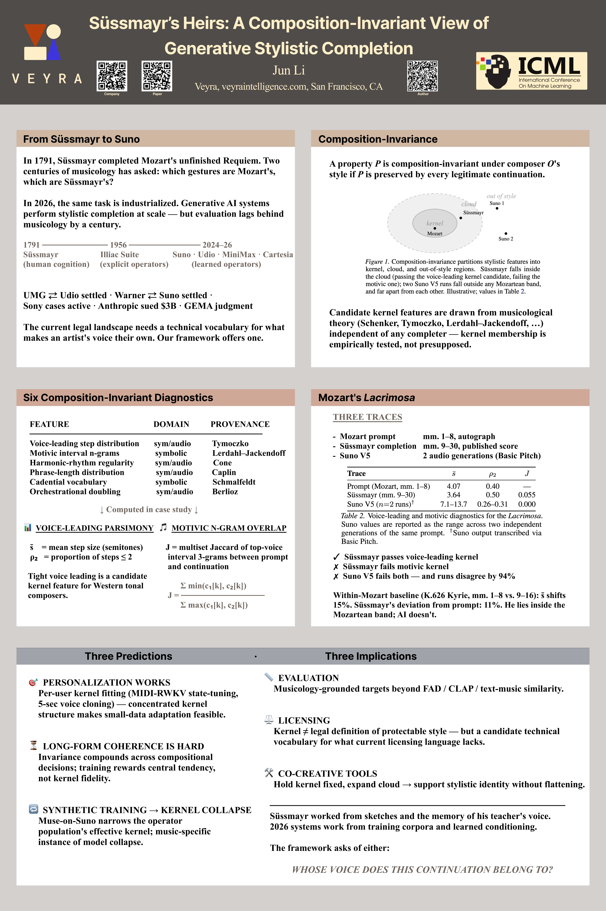
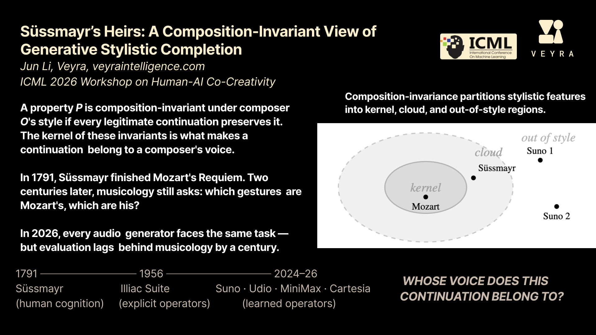

# Süssmayr's Heirs

**[ICML 2026 Workshop on Human-AI Co-Creativity](https://icml.cc/virtual/2026/workshop/54083)** | [Paper](https://icml.cc/virtual/2026/68554)



[](slide.pdf)

https://github.com/user-attachments/assets/f823a1e6-de19-4d5d-be06-baffa655c705

## BibTeX

```bibtex
@inproceedings{
li2026sussmayrs,
title={S\"ussmayr{\textquoteright}s Heirs: A Composition-Invariant View of Generative Stylistic Completion},
author={Jun Li},
booktitle={ICML 2026 Workshop on Human-AI Co-Creativity},
year={2026},
url={https://openreview.net/forum?id=ejQBVAO22r}
}
```
